# Boot Pre-Install Live ISO and Generate Seedfiles

The following steps provide instructions to boot the Pre-Install Live ISo and create seedfiles for CSM installation.

## Topics
1. [Create the Bootable Media](#create-the-bootable-media)
1. [Boot the LiveCD](#boot-the-livecd)
1. [Booting the Master node using Bootable USB](#boot-the-livecd)
1. [Post Boot Configuration](#post-boot-configuration)
1. [Seed File generation](#seed-file-generation)

## Create the Bootable Media

To create the bootable LiveCD image use `dd` command. Before creating the media, identify which device will be used for it. If you already have the bootable media with LiveCD image ready, jump to XXXX.

1. (`external#`) Download the LiveCD ISO.

   ```
   wget http://preserve.eag.rdlabs.hpecorp.net/mirrors/sgi/dist.engr/test/stout7/iso-latest-sles15sp3-x86_64/cm-admin-install-1.9-sles15sp3-x86_64.iso
   ```

1. (`external#`) Identify the USB device.

   >__Note:__ This example shows the USB device is `/dev/sdd` on the host.

   ```bash
   lsscsi
   ```

   Expected output looks similar to the following example:

   ```text
   [6:0:0:0]    disk    ATA      SAMSUNG MZ7LH480 404Q  /dev/sda
   [7:0:0:0]    disk    ATA      SAMSUNG MZ7LH480 404Q  /dev/sdb
   [8:0:0:0]    disk    ATA      SAMSUNG MZ7LH480 404Q  /dev/sdc
   [14:0:0:0]   disk    SanDisk  Extreme SSD      1012  /dev/sdd
   [14:0:0:1]   enclosu SanDisk  SES Device       1012  -
   ```

   In the previous example, the `ATA` devices are the internal disks and the other two devices are the USB drives.
   
   Set a variable pointing to the USB device:

   ```bash
   USB=/dev/sd<disk_letter>
   ```

1. Format the USB device.

   Burn the LiveCD ISO on USB device using `dd` command in the following format:

   ```
   #dd if=$PWD/cm-admin-install-1.9-sles15sp3-x86_64.iso of=$USB bs=4M oflag=sync status=progress
   ```

At this point, image is ready and system can be booted from the USB drive (`/dev/sdd`).

## Boot the LiveCD

Some systems will boot the USB device automatically, if no other OS exists (bare-metal). Otherwise the administrator may need to use the `BIOS Boot Selection menu` to choose the USB device (Option 1).

If an administrator has the node booted with an operating system which will next be rebooting into the LiveCD, then admin can use  `efibootmgr` to set the boot order to be the USB device (Option 2). See the [set boot order](../../background/ncn_boot_workflow.md#setting-boot-order) page for more information about how to set the boot order to have the USB device first.

1. _Option 1_ : Boot LiveCD ISO image using `BIOS Boot Selection menu`

   1. Reboot the server.
   1. Press F6 until the following screen appears.

      
   1. Select the bootable device.

      

1. _Option 2_ : Boot the LiveCD ISO image using `efibootmgr` (This option has not been tested).
      
   >__Note:__ UEFI booting must be enabled in order for the system to find the USB device's EFI bootloader.

        
   1. (`external#`) Confirm that the IPMI credentials work for the BMC by checking the power status.
         
         Set the `BMC` variable to the hostname or IP address of the BMC of the PIT node.
  
         ```bash
           USERNAME=root
           BMC=eniac-ncn-m001-mgmt
           read -r -s -p "${BMC} ${USERNAME} password: " IPMI_PASSWORD
           export IPMI_PASSWORD
           ipmitool -I lanplus -U "${USERNAME}" -E -H "${BMC}" chassis power status
         ```

        >__Note:__ The `read -s` command is used to prevent the credentials from being displayed on the screen or recorded in the shell history.

   1. (`external#`) Power the NCN on and connect to the IPMI console.

      >__Note:__ The boot device can be set via IPMI; the example below uses the `floppy` option. At a glance this seems incorrect, however it selects the primary removable media. This step instructs the user to power off the node to ensure the BIOS has the best chance at finding the USB via a cold boot.
      
      ```bash
      ipmitool chassis bootdev
      ```
      
      ```text
         Received a response with unexpected ID 0 vs. 1
         bootdev <device> [clear-cmos=yes|no]
         bootdev <device> [options=help,...]
         none  : Do not change boot device order
         pxe   : Force PXE boot
         disk  : Force boot from default Hard-drive
         safe  : Force boot from default Hard-drive, request Safe Mode
         diag  : Force boot from Diagnostic Partition
         cdrom : Force boot from CD/DVD
         bios  : Force boot into BIOS Setup
         floppy: Force boot from Floppy/primary removable media
      ```

      ```bash
      ipmitool -I lanplus -U "${username}" -E -H "${BMC}" chassis bootdev floppy options=efiboot
      ipmitool -I lanplus -U "${username}" -E -H "${BMC}" chassis power off
      ```

   1. Insert the USB stick into a recommended USB3 port.

      __Information:__ USB2 port is also compatible, but USB3 port is recommended as it offers the best performance.

   1. (`external#`) Power the server on.

           ```bash
           ipmitool -I lanplus -U "${username}" -E -H "${BMC}" chassis power on
           ipmitool -I lanplus -U "${username}" -E -H "${BMC}" sol activate
           ```

## Booting the Master node using Bootable USB

   1. After selecting the boot device, GRUB menu will show up.

   1. Select the CM Live option from GRUB prompt.

      1. From the GRUB menu, select "CM Live" option.

         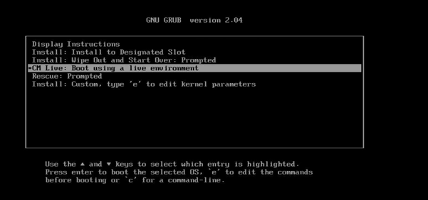

      2. Now a series of input prompts will appear. Provide the responses per the following example:

         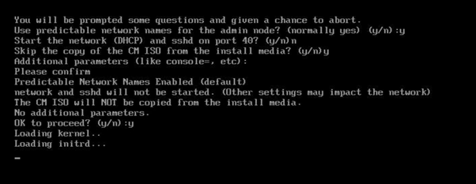

         >__Note:__ You might have to set `console=ttyS0`, `115200n8` or `console=ttyS1,115200n8` on some systems if the boot logs do not show after "Loading initrd...".

         Once the system boots up the OS successfully, provide username and password as `root/cmdefault` to log in to the system.

## Post Boot configuration 

   1. Set the SITE LAN.
   
      To configure the sitelan open a command line terminal and run the following command:

      `172.30.54.111` and `eno1` are examples of IP address and network device names.

      ```
      ifconfig eno1 172.30.54.111 netmask 255.255.240.0 
      ip route add default via <gateway ip> dev eno1
      ```

      
      
      Now this server can be accessed from the external servers using `ssh`. Login to the machine using following command:

      ```
      (external)#  ssh root@172.30.54.111
      ```

   1. Set the hostname.
      ```
           hostnamectl set-hostname starlord
      ```

   1. Set the timezone.
      ```
          timedatectl set-timezone Asia/Kolkata
      ```

   1. Configure Management Switches.

      1.  For spine switches (Mellanox).

          1. Access the spine `switch1` using minicom. Here we assume `/dev/ttyUSB1` is `spine01`.

             ```
              minicom -b 115200 -D /dev/ttyUSB1
             ```
             >__Note:__ Device name may vary.

          1. Login to the spine `switch1` using the switch credentials. Login prompt for Mellanox switch is as follows:

             ```
             Welcome to minicom 2.7.1

             OPTIONS: I18n
             Port /dev/ttyUSB2, 21:51:12

             Press CTRL-A Z for help on special keys

             NVIDIA Onyx Switch Management
             sw-spine01 login: admin
             Password:
             Last login: Fri Nov  4 16:31:03 UTC 2022 from 172.23.0.1 on pts/1
             Last failed login: Fri Nov  4 17:02:03 UTC 2022 from 172.23.0.1 on ssh:notty
             Number of total successful connections since last 1 days: 10
             NVIDIA Switch
             sw-spine01 [standalone: master] >
             ```

          1. Create blank/empty configuration file.

             ``` 
             sw-spine01 [standalone: master] > enable
             sw-spine01 [standalone: master] # configure terminal
             sw-spine01 [standalone: master] (config) # configuration new hpcm_blank1
             sw-spine01 [standalone: master] (config) # configuration switch-to hpcm_blank1
             ```
             Click Yes, if the switch asks for reboot.

             Login to the switch and perform the next steps.

          1. Configure the switch settings.

             ```
             sw-spine01 [standalone: master] > enable
             sw-spine01 [standalone: master] # configure terminal
             ```
             Copy and paste network settings [from here](hpcm_switch_conf_spine_001_gamora.md) and save those configurations as "hpcm_blank1" using the following command:

             ``` 
             sw-spine01 [standalone: master] # configuration write
             ```

             Exit from the switch1 and repeat the procedure for spine `switch2`. The `switch2` settings can be copied [from here](hpcm_switch_conf_spine_002_gamora.md).

      1.  For leaf switches (Dell).

          1. Access the leaf switch using minicom. Here we assume `/dev/ttyUSB3` is leaf switch.

             ``` 
             minicom -b 115200 -D /dev/ttyUSB1
             ```

             >__Note:__ Device name may vary.
  
          1. Access the leaf switch using minicom. Here we assume `/dev/ttyUSB3` is leaf switch.

	        ```
              Welcome to minicom 2.7.1

              OPTIONS: I18n
              Port /dev/ttyUSB3, 16:48:45

              Press CTRL-A Z for help on special keys


              Debian GNU/Linux 9 sw-leaf01 ttyS0

              Dell EMC Networking Operating System (OS10)

              sw-leaf01 login: admin
              Password:
              Last login: Fri Nov  4 17:02:37 UTC 2022 from 172.23.0.1 on pts/0
              Linux sw-leaf01 4.9.189 #1 SMP Debian 4.9.189-3+deb9u2 x86_64

              The programs included with the Debian GNU/Linux system are free software;
              the exact distribution terms for each program are described in the
              individual files in /usr/share/doc/*/copyright.

              Debian GNU/Linux comes with ABSOLUTELY NO WARRANTY, to the extent
              permitted by applicable law.


              -*-*-*-*-*-*-*-*-*-*-*-*-*-*-*-*-*-*-*-*-*-*-*-*-*-*-*-*-*-*-*-*-
              -*         Dell EMC  Network Operating System (OS10)           *-
              -*                                                             *-
              -* Copyright (c) 1999-2020 by Dell Inc. All Rights Reserved.   *-
              -*                                                             *-
              -*-*-*-*-*-*-*-*-*-*-*-*-*-*-*-*-*-*-*-*-*-*-*-*-*-*-*-*-*-*-*-*-

              This product is protected by U.S. and international copyright and
              intellectual property laws. Dell EMC and the Dell EMC logo are
              trademarks of Dell Inc. in the United States and/or other
              jurisdictions. All other marks and names mentioned herein may be
              trademarks of their respective companies.

              %Warning : Default password for admin account should be changed to secure the system
              sw-leaf01#

             ```
          
          1. Clean up the existing configuration and reboot the switch.

             ```
               sw-leaf01# delete startup-configuration
               Proceed to delete startup-configuration [confirm yes/no(default)]:yes
               sw-leaf01# reload
               System configuration has been modified. Save? [yes/no]:no
               Continuing without saving system configuration
               Proceed to reboot the system? [confirm yes/no]:yes
             ```

          1. Re-login to the switch.

             ```
              sw-leaf01# configure terminal
              sw-leaf01(config)#
             ```

             Copy and paste the configuration [from here](hpcm_switch_conf_leaf_gamora.md) and save the configuration using the following command: 

             ```
              sw-leaf01(config)# write configuration
             ```

      >__Note:__ Incase the spine and/or leaf switches are from Aruba then following document an be referred for the configuration in the following link: https://hpedia.osp.hpe.com/wiki/Setting_up_Aruba_Switches_with_HPCM.

   1. Running the YaST First boot.

      Run the following command.

      ```
      /usr/lib/YaST2/startup/YaST2.Firstboot
      ```

         1. Select language and keyboard layout.

            YaST menu can be navigated using TAB keys. Select appropriate language and keyboard layout and click Next.

            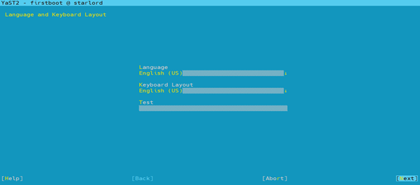

         1. Accepting the Licence Agreement.

            Use spacebar key to accept the licence agreement and click Next.

            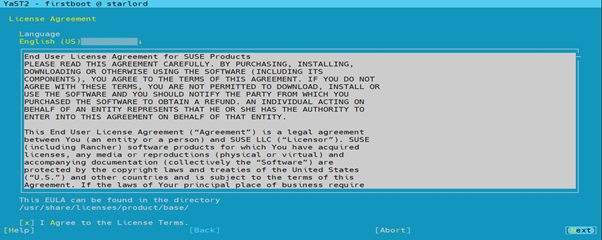
         
         1. Configuring sitelan network using YaST menu.

            

            Fill out the IP Address, Subnet Mask, Hostname (FQDN) fields and click Next.

            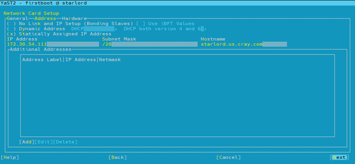
         
         1. Setting the hostname.

            Select the "Hostname/DNS" menu, fill the Static Hostname field and click Next. 

            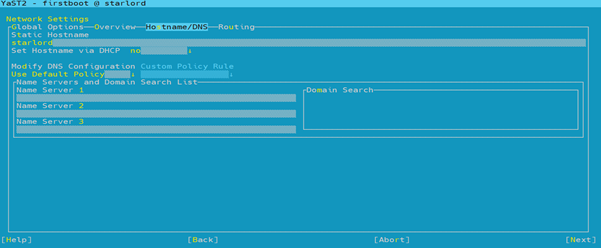

         1. Setting the gateway.

            Navigate to the Routing tab from the UI and enter the gateway information. 
    
         1. Setting the timezone.

            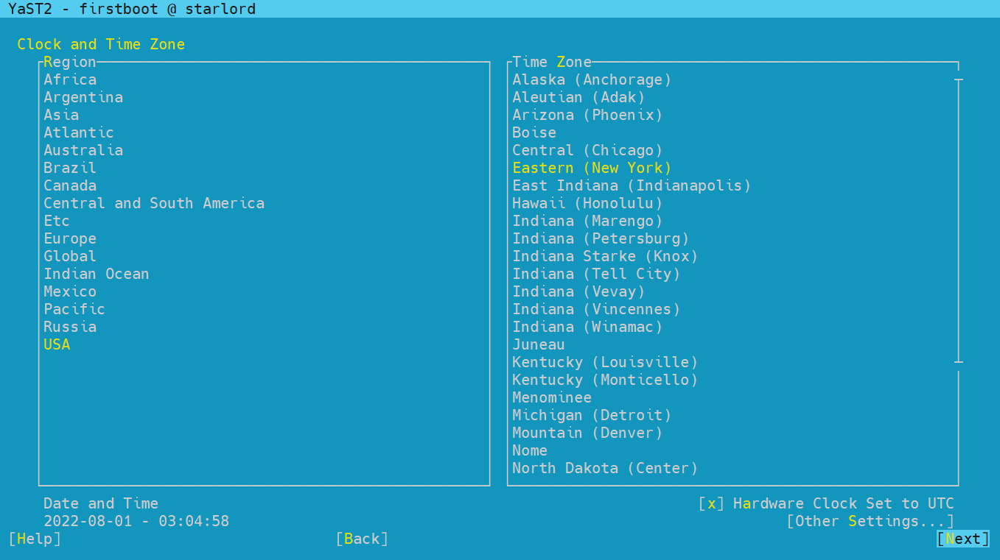
         
         1. Skip the user creation.
            
            Select skip user creation and click Next.

            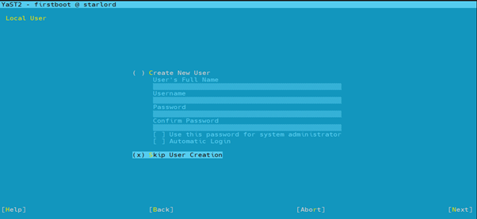
         
         1. Set the root password.

            Fill out the root password.

            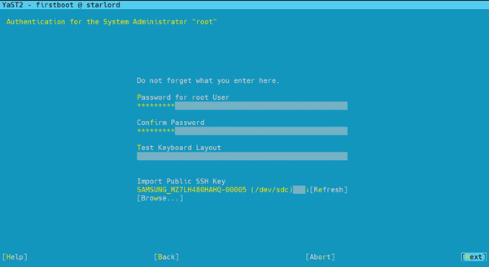

            After setting root user's password, YaST First boot configuration will Finish.

            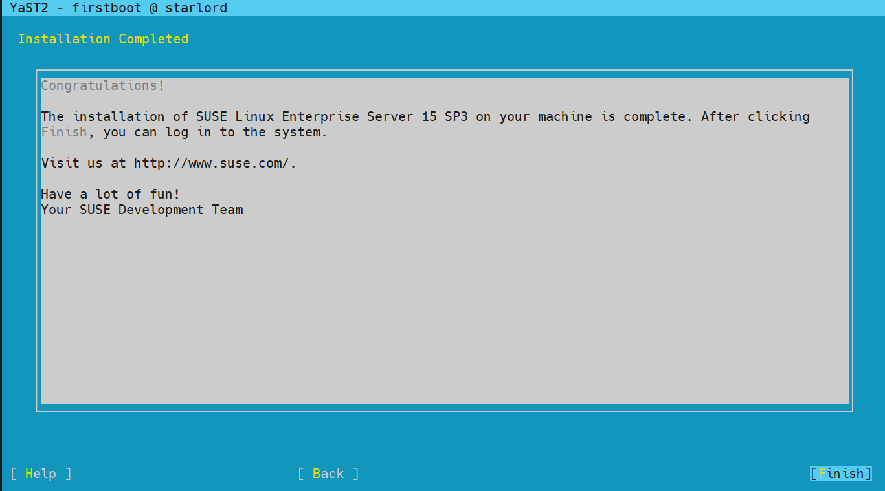
         
         1. Creating the sles 15 sp3 distro repo.

            Download the SLES15 SP3 ISO.

            ```
            wget http://blofly.us.rdlabs.hpecorp.net/mrepo/SLE-15-SP3/SLE-15-SP3-Full-GM-x86_64/iso/SLE-15-SP3-Full-x86_64-GM-Media1.iso 
            wget http://preserve.eag.rdlabs.hpecorp.net/mirrors/novell/sles/15sp3/x86_64/latest/SLE-15-SP3-Full-x86_64-GM-Media1.iso
            ```

            Add the SLES15 repo  using `cm repo` command.

            ``` 
            cm repo add SLE-15-SP3-Full-x86_64-GM-Media1.iso
            ```

         1. Creating the cluster manager repo.

            Download `cm media iso`. 

            ``` 
            https://preserve.eag.rdlabs.hpecorp.net/mirrors/sgi/dist.engr/test/stout7/iso-latest-sles15sp3-x86_64/cm-1.9-cd1-media-sles15sp3-x86_64.iso
            ```

            Add the cluster manager repo using `cm repo` command.

            ``` 
            cm repo add cm-1.9-cd1-media-sles15sp3-x86_64.iso
            ```

         1. List the repos.

            ```
            cm repo show
            ```

            Expected Output:

            ```
            Cluster-Manager-1.9-sles15sp3-x86_64 : /opt/clmgr/repos/cm/Cluster-Manager-1.9-sles15sp3-x86_64
            SLE-15-SP3-Full-x86_64 : /opt/clmgr/repos/distro/sles15sp3-x86_64
            ```

         1. Select and activate the repo.

            Run the following commands and activate repos. 

            ```
            cm repo select SLE-15-SP3-Full-x86_64
            cm repo select Cluster-Manager-1.9-sles15sp3-x86_64
            ```

   1. Run configure-cluster command. 

      1. Configuring the House network Interface.
         
         Select House Network Interface from the list of network interfaces.

         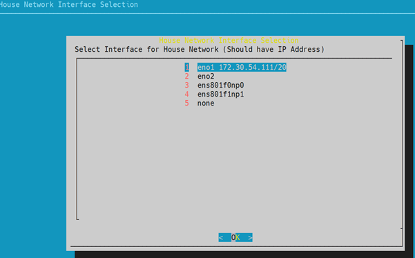

      1. Configuring the management and BMC net interface.

         Select the Management/BMC interface from the list of network interfaces.

         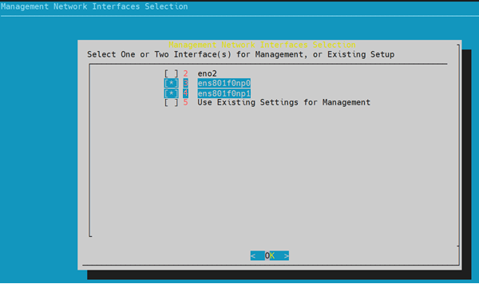

         Select No as we don't need separate network interfaces for BMC and Management network.

         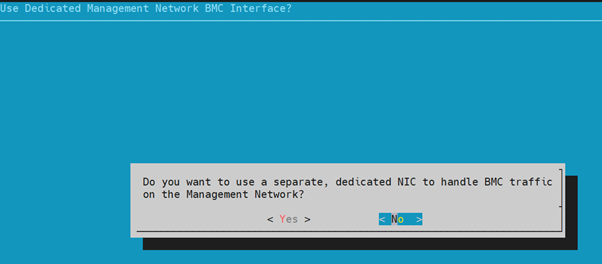

         Select LACP as network bonding type.

         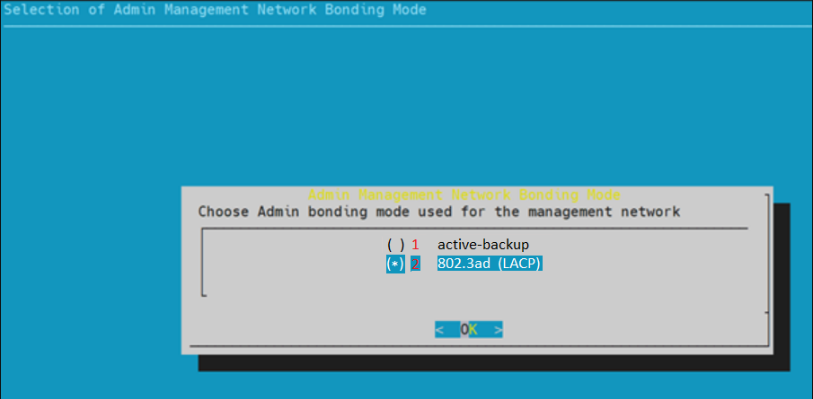

      1. Select the Initial Setup Menu from the Main Menu.

         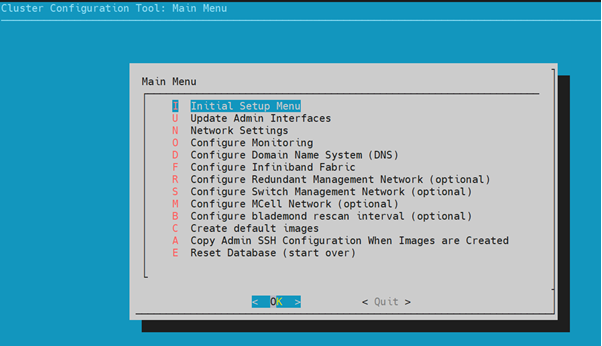
      
      1. Skip the repo selection menu (Repo manager).
         
         We skip this option as required repos were installed using "cm repo add" commands.

         

         Select the Install and Configure Admin Cluster Software option.

         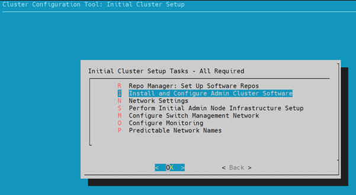
      
         Select and configure the network settings:  

            Select the Network Settings menu option.

            

            Select Yes as we have already configured NTP and timezone settings.

            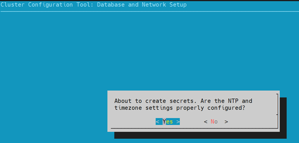

            Start the network and database initialization by clicking OK.

            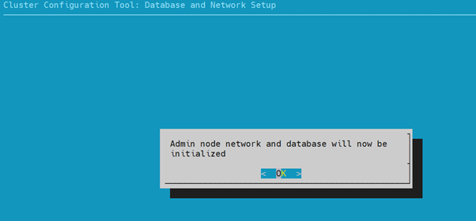

            Click Back on this menu.

            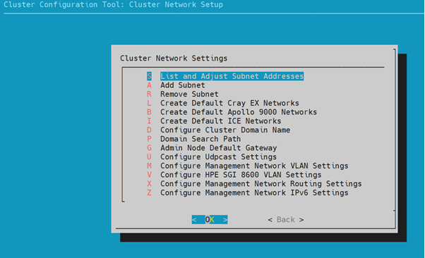

         Select the Perform Initial Admin Node Infrastructure Setup.
         
            
         
            Perform initial cluster setup by clicking OK.

            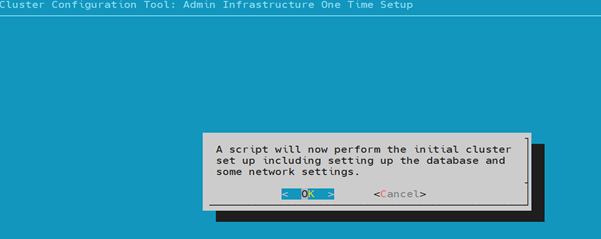

            Domain Search Path input field will be populated by default. Click OK.  

            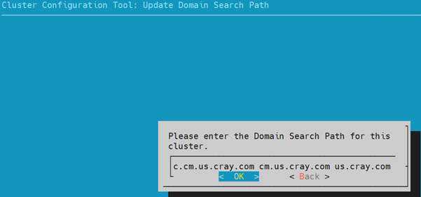

            Leave the Resolver IP fields empty and click OK.

            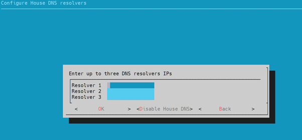

            Click OK on the following prompt.

            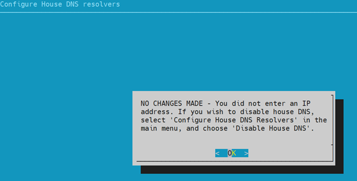

            Select Yes and click OK option. This step will copy ssh configuration from current node to the image . Image will be created in next step. 

            

            Select the "default" image creation option and click OK. 

            

            Once the following prompt appears , click OK, and quit the configure-cluster process.

            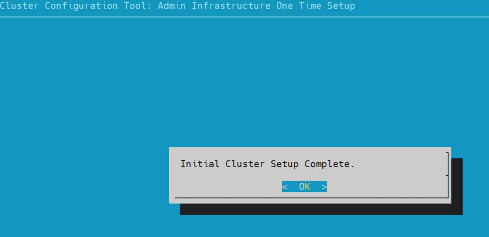

   1. Perform the cluster component discovery using `cm` commands.
      
      The cluster component discovery has to be performed using auto discovery and manual process.

      1. Manual discovery method.

         In this method,  the administrator has to collect  data of components and perform manual discovery. Management Switches, Fabric Switches, PDU and subrack CMCs are the components for which manual discovery method has to be performed. The procedure and the sequence is described as follows:

         1. Management Switch : Discovery of management switches has to be performed by manually creating configuration files. The management switch file should be in a specific format. Here is the example of switch configuration file:
               
               ```
               [discover]
               temponame=mgmtsw0, mgmt_net_name=head, mgmt_net_macs="b8:59:9f:68:8a:00", mgmt_net_interfaces="eth0", transport=udpcast, redundant_mgmt_network=yes, net=head/head-bmc, type=spine, ice=yes, console_device=ttyS1, architecture=x86_64, discover_skip_switchconfig=yes, mgmt_net_ip=172.23.255.251
               temponame=mgmtsw1, mgmt_net_name=head, mgmt_net_macs="b8:59:9f:68:94:00", mgmt_net_interfaces="eth0", transport=udpcast, redundant_mgmt_network=yes, net=head/head-bmc, type=spine, ice=yes, console_device=ttyS1, architecture=x86_64, discover_skip_switchconfig=yes, mgmt_net_ip=172.23.255.252
               temponame=mgmtsw2, mgmt_net_name=head, mgmt_net_macs="e4:f0:04:4e:1a:ec", mgmt_net_interfaces="eth0", transport=udpcast, redundant_mgmt_network=yes, net=head/head-bmc, type=leaf, ice=yes, console_device=ttyS1, architecture=x86_64, discover_skip_switchconfig=yes, mgmt_net_ip=172.23.255.253
               ```
   
               Perform switch discovery.

               ```
               cm node add -c mswitch.conf
               ```
   
         1. For PDU : Create the PDU configuration file. Here is the example of a PSU in configuration file format. 
               
               ```
               [discover]
               internal_name=pdu0, mgmt_bmc_net_name=head-bmc, geolocation="cold isle 4 rack 1 B power",mgmt_bmc_net_macs=00:0a:9c:62:04:ee,hostname1=testpdu0, pdu_protocol="snmp/admn"
               ```

               Perform PDU discovery.

               ```
               cm node add -c pdus.conf
               ```

         1. For Fabric Switch: Use cm controller add to perform discovery.

            ```
            cm controller add -c x3000c0r24b0  -t external_switch -m 00:40:a6:82:f7:5f -u root -p initial0
            ```

         1. For CMC : Use cm controller add to perform discovery.
 
            For gigabyte server. 

            ```
            cm controller add -c SubRack-001-cmc -t gigabyte -m  b4:2e:99:b8:da:03 -u root -p initial0
            ```

         1. For CEC : TBD.

     
      1. Auto-discovery method.

         Management, worker, storage nodes, UANs will be auto discovered and the procedure is described as follows -

         >__Note:__
         > - Ensure all the river components are powered on, dhcp is enabled on bmc and only one switch out of the available spine switch.
         >
         > - If there are multiple spine switches then there should be only 1 spine switch with active port connection to NCNs. On other switches, connections to NCNs should be disabled till all nodes have been booted with HPCM Images. 


         1. Enable auto-discovery process.
            
            The management nodes, worker nodes, storage nodes, UANs and CNs can be auto discovered using the following command:

            ```
            cm node discover enable 
            ```

         1. Wait for discovery process to detect desired hardware components check the status of discovered hardware using following command.

            ```
            cm node discover status
            ```

            And wait till we get data of  the discovered nodes in "Detected server MAC info" section. For example, 

            

         1. Create node configuration  definition file.

            ```
            cm node discover mkconfig -o "mgmt_bmc_net_name=head-bmc, mgmt_net_name=head, redundant_mgmt_network=yes, switch_mgmt_network=yes, dhcp_bootfile=grub2, conserver_logging=yes, conserver_ondemand=no, root_type=disk, console_device=ttyS0, tpm_boot=no, mgmt_net_bonding_master=bond0, disk_bootloader=no, mgmtsw=mgmtsw0, predictable_net_names=yes, transport=udpcast, baud_rate=115200, bmc_username=root, bmc_password=initial0" nodes.conf
            ```

            Example content of `nodes.conf`:

            ```
            [discover]
            internal_name=service1, hostname1=node1, mgmt_bmc_net_macs=b4:2e:99:3b:70:88, mgmt_net_macs=b8:59:9f:1d:da:1e, mgmt_net_interfaces="enp65s0f0np0", mgmt_bmc_net_name=head-bmc, mgmt_net_name=head, redundant_mgmt_network=yes, switch_mgmt_network=yes, dhcp_bootfile=grub2, conserver_logging=yes, conserver_ondemand=no, root_type=disk, console_device=ttyS0, tpm_boot=no, mgmt_net_bonding_master=bond0, disk_bootloader=no, mgmtsw=mgmtsw0, predictable_net_names=yes, transport=udpcast, baud_rate=115200, bmc_username=root, bmc_password=initial0
            internal_name=service2, hostname1=node2, mgmt_bmc_net_macs=b4:2e:99:3b:70:04, mgmt_net_macs=b8:59:9f:34:89:26, mgmt_net_interfaces="enp65s0f0np0", mgmt_bmc_net_name=head-bmc, mgmt_net_name=head, redundant_mgmt_network=yes, switch_mgmt_network=yes, dhcp_bootfile=grub2, conserver_logging=yes, conserver_ondemand=no, root_type=disk, console_device=ttyS0, tpm_boot=no, mgmt_net_bonding_master=bond0, disk_bootloader=no, mgmtsw=mgmtsw0, predictable_net_names=yes, transport=udpcast, baud_rate=115200, bmc_username=root, bmc_password=initial0
            internal_name=service3, hostname1=node3, mgmt_bmc_net_macs=b4:2e:99:3b:70:94, mgmt_net_macs=b8:59:9f:34:89:2e, mgmt_net_interfaces="enp65s0f0np0", mgmt_bmc_net_name=head-bmc, mgmt_net_name=head, redundant_mgmt_network=yes, switch_mgmt_network=yes, dhcp_bootfile=grub2, conserver_logging=yes, conserver_ondemand=no, root_type=disk, console_device=ttyS0, tpm_boot=no, mgmt_net_bonding_master=bond0, disk_bootloader=no, mgmtsw=mgmtsw0, predictable_net_names=yes, transport=udpcast, baud_rate=115200, bmc_username=root, bmc_password=initial0
            internal_name=service4, hostname1=node4, mgmt_bmc_net_macs=b4:2e:99:3b:70:f8, mgmt_net_macs=b8:59:9f:1d:d7:f2, mgmt_net_interfaces="enp65s0f0np0", mgmt_bmc_net_name=head-bmc, mgmt_net_name=head, redundant_mgmt_network=yes, switch_mgmt_network=yes, dhcp_bootfile=grub2, conserver_logging=yes, conserver_ondemand=no, root_type=disk, console_device=ttyS0, tpm_boot=no, mgmt_net_bonding_master=bond0, disk_bootloader=no, mgmtsw=mgmtsw0, predictable_net_names=yes, transport=udpcast, baud_rate=115200, bmc_username=root, bmc_password=initial0
            internal_name=service5, hostname1=node5, mgmt_bmc_net_macs=b4:2e:99:3b:70:9c, mgmt_net_macs=98:03:9b:b4:27:62, mgmt_net_interfaces="enp66s0f0np0", mgmt_bmc_net_name=head-bmc, mgmt_net_name=head, redundant_mgmt_network=yes, switch_mgmt_network=yes, dhcp_bootfile=grub2, conserver_logging=yes, conserver_ondemand=no, root_type=disk, console_device=ttyS0, tpm_boot=no, mgmt_net_bonding_master=bond0, disk_bootloader=no, mgmtsw=mgmtsw0, predictable_net_names=yes, transport=udpcast, baud_rate=115200, bmc_username=root, bmc_password=initial0
            internal_name=service6, hostname1=node6, mgmt_bmc_net_macs=b4:2e:99:3b:70:20, mgmt_net_macs=98:03:9b:bb:a8:94, mgmt_net_interfaces="enp66s0f0np0", mgmt_bmc_net_name=head-bmc, mgmt_net_name=head, redundant_mgmt_network=yes, switch_mgmt_network=yes, dhcp_bootfile=grub2, conserver_logging=yes, conserver_ondemand=no, root_type=disk, console_device=ttyS0, tpm_boot=no, mgmt_net_bonding_master=bond0, disk_bootloader=no, mgmtsw=mgmtsw0, predictable_net_names=yes, transport=udpcast, baud_rate=115200, bmc_username=root, bmc_password=initial0
            internal_name=service7, hostname1=node7, mgmt_bmc_net_macs=b4:2e:99:be:19:f5, mgmt_net_macs=b4:2e:99:be:19:f3, mgmt_net_interfaces="eno1", mgmt_bmc_net_name=head-bmc, mgmt_net_name=head, redundant_mgmt_network=yes, switch_mgmt_network=yes, dhcp_bootfile=grub2, conserver_logging=yes, conserver_ondemand=no, root_type=disk, console_device=ttyS0, tpm_boot=no, mgmt_net_bonding_master=bond0, disk_bootloader=no, mgmtsw=mgmtsw0, predictable_net_names=yes, transport=udpcast, baud_rate=115200, bmc_username=root, bmc_password=initial0
            internal_name=service8, hostname1=node8, mgmt_bmc_net_macs=b4:2e:99:be:1a:71, mgmt_net_macs=b4:2e:99:be:1a:6f, mgmt_net_interfaces="eno1", mgmt_bmc_net_name=head-bmc, mgmt_net_name=head, redundant_mgmt_network=yes, switch_mgmt_network=yes, dhcp_bootfile=grub2, conserver_logging=yes, conserver_ondemand=no, root_type=disk, console_device=ttyS0, tpm_boot=no, mgmt_net_bonding_master=bond0, disk_bootloader=no, mgmtsw=mgmtsw0, predictable_net_names=yes, transport=udpcast, baud_rate=115200, bmc_username=root, bmc_password=initial0
            internal_name=service9, hostname1=node9, mgmt_bmc_net_macs=b4:2e:99:be:1a:39, mgmt_net_macs=b4:2e:99:be:1a:37, mgmt_net_interfaces="eno1", mgmt_bmc_net_name=head-bmc, mgmt_net_name=head, redundant_mgmt_network=yes, switch_mgmt_network=yes, dhcp_bootfile=grub2, conserver_logging=yes, conserver_ondemand=no, root_type=disk, console_device=ttyS0, tpm_boot=no, mgmt_net_bonding_master=bond0, disk_bootloader=no, mgmtsw=mgmtsw0, predictable_net_names=yes, transport=udpcast, baud_rate=115200, bmc_username=root, bmc_password=initial0
            internal_name=service10, hostname1=node10, mgmt_bmc_net_macs=b4:2e:99:be:24:ed, mgmt_net_macs=b4:2e:99:be:24:eb, mgmt_net_interfaces="eno1", mgmt_bmc_net_name=head-bmc, mgmt_net_name=head, redundant_mgmt_network=yes, switch_mgmt_network=yes, dhcp_bootfile=grub2, conserver_logging=yes, conserver_ondemand=no, root_type=disk, console_device=ttyS0, tpm_boot=no, mgmt_net_bonding_master=bond0, disk_bootloader=no, mgmtsw=mgmtsw0, predictable_net_names=yes, transport=udpcast, baud_rate=115200, bmc_username=root, bmc_password=initial0
            internal_name=service11, hostname1=node11, mgmt_bmc_net_macs=b4:2e:99:3b:70:f0, mgmt_net_macs=b8:59:9f:34:88:ea, mgmt_net_interfaces="enp65s0f0np0", mgmt_bmc_net_name=head-bmc, mgmt_net_name=head, redundant_mgmt_network=yes, switch_mgmt_network=yes, dhcp_bootfile=grub2, conserver_logging=yes, conserver_ondemand=no, root_type=disk, console_device=ttyS0, tpm_boot=no, mgmt_net_bonding_master=bond0, disk_bootloader=no, mgmtsw=mgmtsw0, predictable_net_names=yes, transport=udpcast, baud_rate=115200, bmc_username=root, bmc_password=initial0
            internal_name=service12, hostname1=node12, mgmt_bmc_net_macs=b4:2e:99:3b:70:10, mgmt_net_macs=b8:59:9f:1d:d8:c2, mgmt_net_interfaces="enp66s0f0np0", mgmt_bmc_net_name=head-bmc, mgmt_net_name=head, redundant_mgmt_network=yes, switch_mgmt_network=yes, dhcp_bootfile=grub2, conserver_logging=yes, conserver_ondemand=no, root_type=disk, console_device=ttyS0, tpm_boot=no, mgmt_net_bonding_master=bond0, disk_bootloader=no, mgmtsw=mgmtsw0, predictable_net_names=yes, transport=udpcast, baud_rate=115200, bmc_username=root, bmc_password=initial0
            ```

         1. Add discovered nodes, set image for the discovered nodes.

            ```
            cm node discover add nodes1.conf
            cinstallman --assign-image --image sles15sp3 --kernel <kernel version> --node '*'
            cinstallman --set-rootfs tmpfs --node '*'
            cm node refresh netboot -n '*'
            ```

            __NOTE:__ Kernel version can be obtained from `cinstallman --show-default-image` command.

         1. Stop the auto-discovery process and power on all nodes.

            ```
            cm node discover disable
            cm power on -n '*'
            ```

         1. Check the status of nodes.

            ```
            cm power status -n '*'
            ```

            Example output (expected):

            ```
            node1        : BOOTED
            node2        : BOOTED
            node3        : BOOTED
            node4        : On
            node5        : BOOTED
            node6        : BOOTED
            node7        : BOOTED
            node8        : On
            node9        : BOOTED
            node10       : BOOTED
            node11       : BOOTED
            node12       : BOOTED
            ```

            __NOTE:__ We need to wait at this step till all nodes report status as "BOOTED". Now the ports to all the NCNs can be enabled on switches.

         1. Enable passwordless ssh to all the discovered nodes (only if passwordless ssh is not working).

            ```
             for _NODE in `cnodes` do
             ssh-copy-id $_NODE
             done
            ```
	
## Seed File generation

   Here's the stepwise procedure to generate seedfiles.

   1. Obtain `xnames.csv` file for the targetted system's installation.

      The file will have the following format:

      ```
      HOSTNAME,RACK,ULOCATION,SUBLOCATION
      ```

      ```
       Source,Rack,Location,SUBLOCATION
       uan01,x3000,u20,
       ncn-s003,x3000,u09,
       ncn-s002,x3000,u08,
       ncn-s001,x3000,u07,
       ncn-w003,x3000,u06,
       ncn-w002,x3000,u05,
       ncn-w001,x3000,u04,
       ncn-m003,x3000,u03,
       ncn-m002,x3000,u02,
       ncn-m001,x3000,u01,
       nid000004,x3000,u11,L
       nid000003,x3000,u12,L
       nid000002,x3000,u11,R
       nid000001,x3000,u12,R
       ncn-w004,x3000,u13,
       sw-spine01,x3000,u39,
       sw-spine02,x3000,u40,
       sw-leaf-bmc-01,x3000,u37,
      ```

   1. Create `cabinets.yaml` (Manually).

   1. Capture hardware inventory.

      The following command stores the inventory of nodes and switches (fabric and management) in the database.

      ```
      cm cvt config create -t all --mgmt_username 'uname' --mgmt_password 'passwd'  --fabric_username 'fabric_uname' --fabric_password 'fabric_pass'  --load_xname /root/new-cluster-config-verification-tool/xnames.csv --architecture '<architecture>'
      ```

   1. Save the generated seed files (`switch_metadata.csv`, `application_node_config.yaml`, `hmn_connections.json`, `ncn_metadata.csv`, `cabinets.yaml`), paddlefile (`cvt-ccj.json`) and `cvt.json`. The seed files (or configuration payload files) and paddlefile will be used later during the CSM installation process so they can be saved/backed up in a persistent storage.

## CleanUp (Optional)

   1. If the amount of memory on the booted system is low, then cleanup step can be performed by removing the downloaded ISO files and deleting the images.

   ```
   rm *.iso 
   cm image delete -i sles15sp3
   cm repo del Cluster-Manager-1.9-sles15sp3-x86_64
   cm repo del SLE-15-SP3-Full-x86_64    
   ```

   These steps can help reclaim ~40 GB of space in the `tmpfs/overlay` partition.
 
